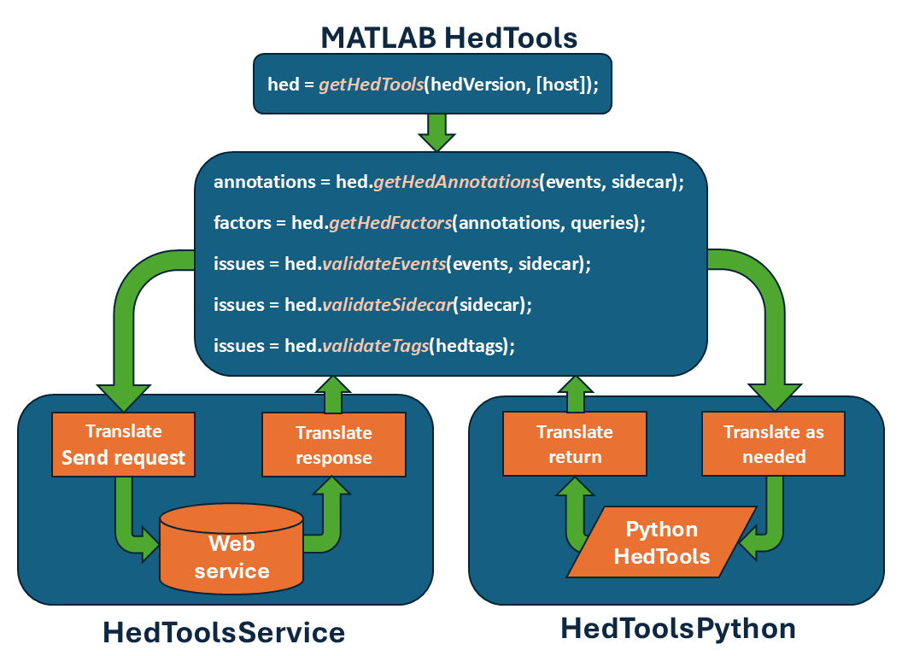
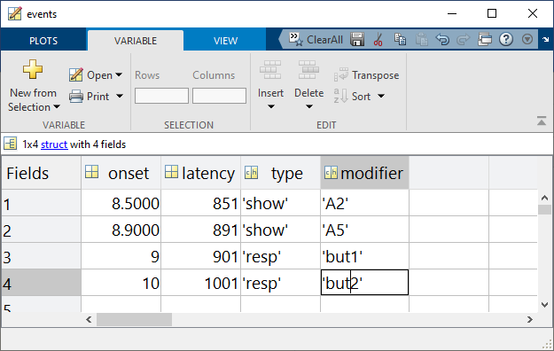

```{index} user guide
```

```{index} single: HED; MATLAB HEDTools
```

```{index} MATLAB HEDTools
```

# User guide

HED (Hierarchical Event Descriptors) is a framework for annotating behavioral, physiological, and other events in scientific data using standardized, machine-readable vocabulary organized in hierarchical tag trees. HED is used for human behavioral and neuroimaging experiments.

MATLAB HEDTools provides a convenient interface for MATLAB users to validate HED annotations, search and summarize events, remodel event data, perform factorization and data epoching, and integrate HED with MATLAB-based analysis workflows such as EEGLAB.

```{index} installation
```

(installation)=

## Installation

### Downloading hed-matlab

MATLAB HEDTools can be downloaded from the [hed-matlab](https://github.com/hed-standard/hed-matlab) GitHub repository.

**Using Git:**

```shell
git clone https://github.com/hed-standard/hed-matlab.git
```

**Using zip download:**

You can also download the latest release as a zip file from the [**hed-matlab releases**](https://github.com/hed-standard/hed-matlab/releases) tab on GitHub.

**Setting up your MATLAB path:**

Once you have downloaded (and unzipped if necessary), add the `hedmat` directory and all of its subdirectories to your MATLAB path:

```matlab
myPath = 'xxx';  % This should be the full path to hedmat
addpath(genpath(myPath));
```

The following table describes the directories of this repository:

| Directory                   | Description                                                           |
| --------------------------- | --------------------------------------------------------------------- |
| `data`                      | Data used for the demos and tests.                                    |
| `docs`                      | Source code for the documentation.                                    |
| `hedmat/hedtools`           | MATLAB interface for the HED tools.                                   |
| `hedmat/remodeling_demos`   | Demos of calling the table remodeler.                                 |
| `hedmat/utilities`          | General purpose utilities.                                            |
| `hedmat/web_services_demos` | Demos of directly using the HED web services (without hedtools).      |
| `tests`                     | Unit tests for MATLAB. (Execute `run_tests.m` to run all unit tests.) |

```{index} web services
```

```{index} single: installation; web services
```

### Web services (no install)

The simplest way to use MATLAB HEDTools is through web services. This approach:

- **Requires no installation** beyond downloading the MATLAB HEDTools package
- **Requires Internet access** to connect to HED web services
- Works immediately without any Python setup

```{index} Python; direct calls
```

```{index} single: installation; Python
```

### Using Python directly

For more efficient operation and additional functionality, you can configure MATLAB to call the Python HEDTools directly. This approach:

- **Requires one-time Python setup** (Python 3.10+, HEDTools package)
- **Provides better performance** than web services
- **Works offline** once configured
- **Provides access to additional features** not available through web services
- Some additional functionality not in the MATLAB HEDTools interface is directly accessible through Python

For Python installation instructions, see [MATLAB Python install](#matlab-python-install).

```{index} examples
```

## Quick example

Here's a simple example to get you started with HED validation in MATLAB:

````{admonition} HED validation in MATLAB using web services
---
class: tip
---
```matlab
% Get HED tools using web services
hed = getHedTools('8.4.0', 'https://hedtools.org/hed');

% Validate a string containing HED tags
issues = hed.validateTags('Sensory-event,Red,(Image,Face)');

if isempty(issues)
    disp('HED string is valid!');
else
    disp(issues);
end
```
````

```{index} tool overview
```

## Tool overview

MATLAB HEDTools provide the following interface to HEDTools as explained in more detail in the following sections. The MATLAB HEDTools package provides two interchangeable implementations of these functions -- calling the HED Python tools through a web service or directly calling the Python HEDTools.

To use HED tools, you first create a HED object by calling `getHedTools`. If you provide the optional host argument, the HED tools use services, otherwise direct calls to Python. Once created, you simply call the available methods using that reference. The process is summarized in the following diagram.



Both approaches take MATLAB data as input and translate these values as needed to access the HEDTools. After making the call, the implementation translates the results back into MATLAB data types. The MATLAB HedTools accept a variety of different types of MATLAB variables as input.

Another option is to use [CTagger](https://www.hedtags.org/CTagger) integration for HED. The EEGLAB plug-ins provide easy access through the EEGLAB GUI interface.

A third option is the EEGLAB [HEDTools plugin](https://github.com/sccn/HEDTools) which performs validation and epoching on EEG datasets.

```{index} MATLAB; interface
```

```{index} getHedAnnotations
```

```{index} searchHed
```

```{index} validateEvents
```

```{index} validateSidecar
```

```{index} validateTags
```

## MATLAB HEDTools interface

MATLAB HEDTools provide the following routines for accessing HED:

| MATLAB function     | Parameters                                                                  | Returns                        |
| ------------------- | --------------------------------------------------------------------------- | ------------------------------ |
| `getHedAnnotations` | `events`, `sidecar`, `includeContext`\*, `replaceDefs`\*, `removeTypesOn`\* | cell array of `char`           |
| `searchHed`         | `annotations`, `queries`                                                    | *n* x *m* array of 1's and 0's |
| `validateEvents`    | `events`, `sidecar`, `checkWarnings`\*                                      | `char`                         |
| `validateSidecar`   | `sidecar`, `checkWarnings`\*                                                | `char`                         |
| `validateTags`      | `hedtags`, `checkWarnings`\*                                                | `char`                         |

*\* indicates optional Name-Value parameter*

The parameters are defined as follows:

| Parameter          | Description                                    | MATLAB type                                                     |
| ------------------ | ---------------------------------------------- | --------------------------------------------------------------- |
| `annotations`      | HED annotations (one for each event)           | cell array of `char` or `string`, (or of `HedString` if Python) |
| `events`           | Event file information or actual events        | `char`, `string`, `struct` (or `TabularInput` if Python)        |
| `sidecar`          | JSON sidecar or dictionary with HED info       | `char`, `string`, `struct` (or `Sidecar` if Python)             |
| `hedtags`          | A single HED annotation string                 | `char`, `string` (or `HedString` if Python)                     |
| `queries`          | HED query expressions                          | Cell array of `char` or `string`                                |
| `checkWarnings`\*  | If true, check warnings (default true)         | `true` or `false`                                               |
| `includeContext`\* | If true, include event contexts (default true) | `true` or `false`                                               |
| `removeTypesOn`\*  | If true, remove type variables (default true)  | `true` or `false`                                               |
| `replaceDefs`\*    | If true, expand Def tags (default true)        | `true` or `false`                                               |

## Using MATLAB HEDTools

This section gives some examples of using MATLAB HEDTools.

```{index} getHedTools
```

```{index} HedTools; object
```

### Getting a HEDTools object

MATLAB HEDTools are all called by getting a `HedTools` object and then making the calls through this object. Use the `getHedTools` function to get a `HedTools` object.

The following example gets a `HedTools` object using version 8.4.0 of the HED schema (standard vocabulary) and the webservice available at [https://hedtools.org/hed](https://hedtools.org/hed).

````{admonition} Access HED tools through web services.
---
class: tip
---
```matlab
hed = getHedTools('8.4.0', 'https://hedtools.org/hed');
```
````

The first parameter is number of the HED version to use, and the second parameter is the URL of the web service. The `hed` returned by this call is `HedToolsService`, which implements the interface by calls to HED web services. The [https://hedtools.org/hed](https://hedtools.org/hed) is the primary server for the HED online tools. An alternative server for the web services is [https://hedtools.org/hed_dev](https://hedtools.org/hed_dev). This is the HED development server, which deploys the latest features.

If you have installed the HED Python tools, you can access the MATLAB HEDTools interface using direct calls to Python.

````{admonition} Access HED tools through direct Python calls.
---
class: tip
---
```matlab
hed = getHedTools('8.4.0');
````

````

If you call the `getHedTools` with only the HED version number parameter, `getHedTools` assumes you are using direct calls to Python and returns a `HedToolsPython` object. The MATLAB HEDTools interface calls and behavior are identical whether you use the services or direct calls. You must have the HED Python tools installed to use direct calls. See [MATLAB Python install](#matlab-python-install).

### Calling a tool

Once you have the HED tools object, you can use it to call the tools listed above as illustrated in the following example:

```{admonition} Validate a string containing HED tags.
---
class: tip
---

```matlab
issues = hed.validateTags('Sensory-event,Red,Blech,(Image,Banana)');
```
````

The `issues` is a printable `char` array. The HED tags string in the above example has two unrecognized tags: *Blech* and *Banana*. The call to `validateTags` produces the following `issues` message:

```text
TAG_INVALID: 'Blech' in Blech is not a valid base hed tag.
TAG_INVALID: 'Banana' in Banana is not a valid base hed tag.
```

```{index} events
```

```{index} single: events; tabular input
```

```{index} single: events; struct array
```

## Input of events

Events are markers on the experimental timeline that indicate something of interest. One of HED's primary purposes is to annotation event markers with usable metadata to assist in analysis.

Events are generally represented in a tabular input form with column names. Each row in such a table corresponds to information associated with one event marker.

| row # | onset | latency | type | modifier |
| ----- | ----- | ------- | ---- | -------- |
| 1     | 8.5   | 851     | show | A2       |
| 2     | 8.9   | 891     | show | A5       |
| 3     | 9     | 901     | resp | key1     |
| 4     | 10    | 1001    | resp | key2     |

HED expects that event files have an `onset` column that provides the time in seconds of the event marker relative to the experimental timeline.

When this data is stored in a tab-separated value file called `test.tsv`, it can be read as:

````{admonition} Read a tab-separated value file into a char array.
---
class: tip
---
```matlab
events = fileread('test.tsv');
```
````

The same data can also be stored in MATLAB `struct` array:

````{admonition} Store events in a MATLAB struct array.
---
class: tip
---
```matlab
events(1) = struct('onset', 8.5, 'latency', 851, 'type', 'show', 'modifier', 'A2');
events(2) = struct('onset', 8.9, 'latency', 891, 'type', 'show', 'modifier', 'A5');
events(3) = struct('onset', 9, 'latency', 901, 'type', 'resp', 'modifier', 'key1');
events(4) = struct('onset', 10, 'latency', 1001, 'type', 'resp', 'modifier', 'key2');
```
````

Displaying events on the MATLAB command line just gives the overall structure, but the MATLAB workspace editor provides a more informative view:



Once you have events data, it is easy to validate the HED associated with this data as shown by the following example:

````{admonition} Validate events data.
---
class: tip
---
```matlab
issues = hed.validateEvents(events, sidecar);
```
````

```{index} sidecar
```

```{index} JSON; sidecar
```

```{index} BIDS; sidecar
```

## Input of sidecars

A tabular dataset may have a `HED` column whose entries provide HED annotations for the individual event markers represented by the rows. However, a more typical approach to annotation is to provide an additional dictionary, often called a sidecar. In [BIDS](https://bids.neuroimaging.io/) the sidecar dictionaries are represented in [JSON](https://www.json.org/json-en.html) format. The MATLAB `jsonencode` and `jsondecode` translate various MATLAB data types into a JSON-compliant `char` value.

HED expects that sidecars will follow the BIDS format for sidecars associated with tabular files. The top-level JSON is a dictionary with keys that are the column names of the associated tabular file. Each key points to a dictionary of metadata for a column. One of the keys in this second dictionary can be `HED` as illustrated by the following example.

````{admonition} JSON sidecar for the events of previous section.
---
class: tip
---
```json
{
  "type": {
    "HED": {
      "show": "Sensory-presentation, Experimental-stimulus",
      "resp": "Agent-action, Participant-response"
    }
  },
  "modifier": {
    "HED": {
      "A2": "(Face, Image)",
      "A5": "(Animal/Horse, Image)",
      "key1": "(Press, (Left, Mouse-button))",
      "key2": "(Press, (Right, Mouse-button))"
    }
  }
}
```

````

```{index} annotations; assembly
```

```{index} getHedAnnotations; usage
```

## Assembling HED annotations

The `getHedAnnotations` tool assembles the complete HED annotation for each event marker (i.e., each row in an event structure).

````{admonition} Assembling HED annotations.
---
class: tip
---
```matlab
annotations = hed.getHedAnnotations(events, sidecar);
```

````

Here `annotations` is a cell array with the same number of rows as `events` containing the `char` HED annotations for the `events`. The HEDTools look up the HED annotation for each element in a row of an events table and concatenate those together (comma-separated) to form the HED annotation for the event marker.

For the event data and sidecar defined in the previous sections, the sidecar provides HED annotations for the `type` and `modifier` columns. The resulting HED annotations for each row are given in the following table:

| row | HED annotation                                                       |
| --- | -------------------------------------------------------------------- |
| 1   | *Sensory-presentation, Experimental-stimulus, (Face, Image)*         |
| 2   | *Sensory-presentation, Experimental-stimulus, (Animal/Horse, Image)* |
| 3   | *Agent-action, Participant-response, (Press, (Left, Mouse-button))*  |
| 4   | *Agent-action, Participant-response, (Press, (Right, Mouse-button))* |

The annotation for the first row consists of the HED tags for the `show` value in column `type` (i.e., *Sensory-presentation, Experimental-stimulus*) concatenated with the HED tags for the `A2` value in column `modifier` (i.e., *(Face, Image)*). Note: HED annotations are unordered, so the tags may appear in any order. Use parentheses to group tags as appropriate.

The example annotations do not use any `Def` tags, so the `replaceDefs` option is not relevant. Users can give a name to particular string of HED tags using the `Definition` tag and then use the `Def` tag with that name as a shortcut in annotations. The `Def` tags are useful for tag strings that are frequently used and are required to define event processes. However, when assembling annotations to search for tags, you usually want to replace these shortcut `Def` tags with the actual HED tags they represent. Thus, the default value of `replaceDefs` is true. See [Advanced annotation](https://www.hedtags.org/hed-specification/05_Advanced_annotation.html) for details.

Since no special tags defining extended event processes are used (i.e., `Onset`, `Offset`, `Duration`) in the example annotations, the `includeContext` option has no effect in this example. If `includeContext` is true (the default) event processes contribute their tags to the `Event-context` of time markers that fall in their scope. See [Advanced annotation](https://www.hedtags.org/hed-specification/05_Advanced_annotation.html) for an explanation of this.

The example annotation does not contain any `Condition-variable` or `Task` tags, so `removeTypesOn` has no effect. Typically `removeTypesOn` should be true to remove the effects of these tags for ordinary assembly and searching as extraction of design matrices is a separate operation. See [HED conditions and design matrices](https://www.hedtags.org/hed-resources/HedConditionsAndDesignMatrices.html) for additional information.

```{index} searching; HED annotations
```

```{index} searchHed; usage
```

```{index} queries
```

## Searching HED annotations

The `searchHed` tool takes a cell array of *n* HED annotations and a cell array of *m* HED search queries and returns an *n* x *m* array of 1's and 0's indicating whether the annotations satisfy the queries.

````{admonition} Example search of HED annotations
---
class: tip
---
```matlab
factors = hed.searchHed(annotations, {'Sensory-event', 'Agent-action'});
```
````

The result of this query is the following:

| Column 1 | Column 2 |
| -------- | -------- |
| 1        | 0        |
| 1        | 0        |
| 0        | 1        |
| 0        | 1        |

The queries can be quite complex as described in the [HED search guide](https://www.hedtags.org/hed-resources/HedSearchGuide.html).

```{index} Python; installation
```

```{index} single: installation; Python
```

```{index} pyenv
```

(matlab-python-install)=

## MATLAB Python install

Although MATLAB began python support of python in 2014, **you must be using MATLAB version 2020b or later** with the HEDTools because the current version of the HEDTools requires Python 3.10 or later. See [compatible version of Python](https://www.mathworks.com/support/requirements/python-compatibility.html) for a listing of which Python versions are compatible with which versions of MATLAB.

**Note:** For your reference, the source for `hedtools` is the [hed-python](https://github.com/hed-standard/hed-python) GitHub repository. The code is fully open-source with an MIT license. The actual API documentation is available [here](https://www.hedtags.org/hed-python), but the tutorials and tool documentation for `hedtools` on [HED Resources](https://www.hedtags.org/hed-resources/index.html) site provides more examples of use.

You will need at least MATLAB version R2022b, since the Python HEDTools require at least Python 3.10. See MathWorks Python [compatibility Docs](https://www.mathworks.com/support/requirements/python-compatibility.html) for additional information.

### Installing Python

The greatest difficulty for users who are unfamiliar with Python is getting Python connected to MATLAB. Once that is done, many of the standard `hedtools` functions can be accessed through method call that take MATLAB variables and return either MATLAB variables or opaque objects that can be passed to other MATLAB functions.

Thus, once the setup is done, you don't have to learn any Python syntax to use the tools. You should only have to do this setup once, since MATLAB retains the setup information from session to session.

```{admonition} Steps for setting up Python HEDtools for MATLAB.
---
class: tip
---
**Step 1: Find Python**. If a version >= Python 3.10 is found, skip to Step 3.

**Step 2: Install Python**.

**Step 3: Connect Python**. If already connected, skip to Step 4.

**Step 4: Install HEDtools**
```

#### Step 1: Find Python

Follow these steps until you find a Python executable that is version 3.10 or greater. If you can't locate one, you will need to install it.

````{admonition} Does MATLAB already have a good version of Python you can use?

In your MATLAB command window execute the following function:

```matlab
>> pyenv
```

The following example response shows that MATLAB on Windows is using Python version 3.10 with executable located at `C:\Program Files\Python\Python310\python.EXE`.

````

If MATLAB has already knows about a suitable Python version that is at least 3.10, you are ready to go to **Step 4: Install HEDTools**. Keep track of the location of the Python executable.

If the `pyenv` did not indicate a suitable Python version, you will need to find the Python on your system (if there is one), or install your own.

There are several likely places to look for Python on your system.

**For Linux users**:

> Likely places for system-space installation are `/bin`, `/local/bin`, `/usr/bin`, `/usr/local/bin`, or `/opt/bin`. User-space installations are usually your home directory in a subdirectory such as `~/bin` or `~/.local/bin`. The `which python` command will list the Python executable that is first found in your path.

**For Windows users**:

> Likely places for system-space installation are `C:\`, `C:\Python`, `C:\Program Files` or `C:\Program Files\Python`. User-space installations default to your personal account in `C:\Users\yourname\AppData\Local\Programs\Python\python310` where `yourname` is your Windows account name and `python310` will be the particular version (in this case Python 3.10).

If you don't have any success finding a Python executable, you will need to install Python as described in **Step 2: Install Python** if you don't have an appropriate version of Python already installed.

Otherwise, you can skip to **Step 3: Connect Python**.

```{warning}
**You need to keep track of the path to your Python executable for Step 3.**
```

#### Step 2: Install Python

If you don't have Python on your system, you will need to install it. Go to [Python downloads](https://www.python.org/downloads/) and pick the correct installer for your operating system and version.

Depending on your OS and the installer options you selected, Python may be installed in your user space or in system space for all users.

- You should keep track of the directory that Python was installed in.
- You may want to add the location of the Python executable to your system or user PATH.

```{warning}
MATLAB installs add-ons such as the HEDTools in a specific user directory as described below. This makes user-installed Python modules available to all MATLAB projects. **For this reason, we do not recommend trying to set up a virtual environment.**
```

#### Step 3: Connect Python

Setting the Python version uses the MATLAB `pyenv` function with the `'Version'` argument as illustrated by the following example.

````{admonition} Example MATLAB function call connect MATLAB to Python.
---
class: tip
---
```matlab
>> pyenv('Version', 'C:\Program Files\Python\Python310\python.exe')
```
````

Be sure to substitute the path of the Python that you have found.

Use the MATLAB `pyenv` function again without arguments to check that your installation is as expected.

#### Step 4: Install HEDTools

The general-purpose package manager for Python is called `pip`. By default, `pip` retrieves packages to be installed from the [PyPI](https://pypi.org) package repository. You will need to use the version of `pip` that corresponds to the version of Python that is connected to MATLAB. The right version of `pip` is found in the `Scripts` subdirectory of your Python installation.

To install the latest released version of `hedtools` type a `pip` command such as the following in your MATLAB command window.

````{admonition} Command to install HEDTools in MATLAB.
---
class: tip
---
```matlab
system('"C:\Program Files\Python\Python310\Scripts\pip" install hedtools')
```
````

Use the full path of the `pip` associated with the Python that your MATLAB is using.

Giving the full path to correct version of `pip` ensures that MATLAB knows about `HEDtools`. (The version of Python that MATLAB is using may not be the same as the Python in the system PATH.)

```{index} best practices
```

```{index} version management
```

```{index} error handling
```

## Best practices

### Web services vs Python

- **Use web services** for:

  - Quick prototyping and testing
  - Simple validation tasks
  - Situations where Python installation is not feasible
  - Teaching or demonstrations

- **Use direct Python calls** for:

  - Large-scale batch processing
  - Offline or air-gapped environments
  - Performance-critical applications
  - Advanced features not available through web services

### Version management

- Always specify the HED schema version explicitly in your code
- Use the same HED schema version throughout a project
- Document which HED schema version was used in your analysis
- Check the [changelog](https://github.com/hed-standard/hed-schemas/releases) when upgrading versions

### Error handling

Always check for validation issues before proceeding with analysis.

````{admonition} Validating an events file with sidecar
---
class: tip
---
```matlab
issues = hed.validateEvents(events, sidecar);
if ~isempty(issues)
    error('Validation failed:\n%s', issues);
end
```
````

```{index} troubleshooting
```

```{index} common issues
```

## Troubleshooting

### Common issues

**Problem**: `pyenv` shows wrong Python version or empty

**Solution**: Set the Python version explicitly using `pyenv('Version', '/path/to/python')`

______________________________________________________________________

**Problem**: `hedtools` not found when using Python calls

**Solution**: Make sure you installed `hedtools` using the pip associated with the Python version MATLAB is using

______________________________________________________________________

**Problem**: Web service timeout or connection errors

**Solution**: Check your internet connection and firewall settings. Try the alternative server at `https://hedtools.org/hed_dev`

______________________________________________________________________

**Problem**: Validation reports unexpected errors

**Solution**: Verify you're using the correct HED schema version for your dataset. Check the dataset's `dataset_description.json` file for the HED version.

### Getting help

Additional documentation resources:

- **[API reference](api2.rst)**: Detailed MATLAB function documentation
- **[HED specification](https://www.hedtags.org/hed-specification)**: Formal annotation rules
- **[HED resources](https://www.hedtags.org/hed-resources)**: HED tutorials and guides

If you encounter issues not covered here:

1. Check [GitHub issues](https://github.com/hed-standard/hed-matlab/issues) to see if the problem is already reported.
2. If not, open a new issue with:
   - A clear, descriptive title
   - Detailed description of the problem
   - Steps to reproduce
   - Expected vs. actual behavior
   - MATLAB version and operating system
3. For HED-specific questions, see the [HED resources](https://www.hedtags.org/hed-resources) site.

```{index} resources
```

```{index} HED; resources
```

## Related HED resources

- **[HED homepage](https://www.hedtags.org)**: Overview and links for HED
- **[HED schemas](https://www.hedtags.org/hed-schemas)**: Standardized vocabularies in XML/MediaWiki/OWL formats
- **[HED specification](https://www.hedtags.org/hed-specification/)**: Formal specification defining HED annotation rules
- **[HED online tools](https://hedtools.org/hed)**: Web-based interface requiring no programming
- **[HED resources](https://www.hedtags.org/hed-resources)**: Comprehensive tutorials and documentation
- **[Python HEDTools](https://www.hedtags.org/hed-python)**: Python library that powers these MATLAB tools
- **[Sphinx documentation](https://www.sphinx-doc.org/)**: Documentation generator used to build these docs
- **[MyST parser](https://myst-parser.readthedocs.io/)**: Markdown parser for Sphinx

```{index} funding
```

## Funding

Partial support for this project was provided by [NIH 1R01MH126700-01A1](https://reporter.nih.gov/project-details/10480619).

```{index} development
```

```{index} contributing
```

```{index} documentation; building
```

## Development

This section provides instructions for contributors who want to develop MATLAB HEDTools code or build the documentation locally.

### Environment setup

**Prerequisites:**

- Python 3.10 or later
- Git (to clone the repository)

**Create virtual environment** (recommended):

**On Windows (PowerShell)**:

```powershell
python -m venv .venv
.venv\Scripts\Activate.ps1
```

**On Linux/macOS**:

```bash
python -m venv .venv
source .venv/bin/activate
```

**Install dependencies:**

The development and documentation dependencies are defined in `pyproject.toml`. Install them using:

```shell
pip install -e .[dev,docs]
```

This installs all required packages including:

**Documentation tools:**

- Sphinx (documentation generator)
- Furo theme
- MyST parser (for Markdown support)
- sphinxcontrib-matlabdomain (for MATLAB code documentation)
- sphinx-copybutton and other extensions

**Development tools:**

- ruff (linter and formatter)
- codespell (spell checker)
- mdformat (Markdown formatter)

### Building the docs

From the repository root, run:

```shell
sphinx-build -b html docs docs/_build/html
```

The generated HTML documentation will be in `docs/_build/html/`. Open `docs/_build/html/index.html` in your browser to view it.

**To rebuild from scratch** (clean build):

```shell
sphinx-build -b html docs docs/_build/html -E
```

The `-E` flag forces a full rebuild of all files, ignoring the cache.

### Modifying the docs

1. **Edit Markdown files**: Most documentation is written in Markdown (`.md` files) using the MyST parser.

2. **Rebuild documentation**: After making changes, rebuild the docs to see your changes:

   ```shell
   sphinx-build -b html docs docs/_build/html
   ```

3. **Check for errors**: Review the build output for any warnings or errors.

4. **Preview changes**: Open the generated HTML in your browser to verify your changes.

### Documentation style guidelines

- Use clear, descriptive headings following the hierarchy: `#` for titles, `##` for sections, `###` for subsections
- Include code examples with proper language tags (```` ```matlab ```` for MATLAB code)
- Use MyST directives for admonitions: ```` ```{admonition} ```` blocks
- Link to files using workspace-relative paths: `[text](path/file.md)`
- Add index entries for important terms using ```` ```{index} term ```` blocks
- Follow the existing style in current documentation files

### MATLAB code development

#### Running tests

The MATLAB unit tests are located in the `tests/` directory. To run all tests:

1. Open MATLAB.

2. Add hedmat to your path:

   ```matlab
   addpath(genpath('hedmat'));
   addpath(genpath('tests'));
   ```

3. Run the test suite:

   ```matlab
   run_tests
   ```

This executes all test files matching the pattern `Test*.m` in the `tests/` directory.

#### Testing components

- **HED tools tests**: `tests/test_hed_tools/`
- **Utilities tests**: `tests/test_utilities/`

To run tests for a specific component, navigate to the test directory and run the individual test file.

#### Code style guidelines

- Use clear, descriptive function and variable names
- Include comprehensive doc comments using `%%` section markers
- Follow MATLAB naming conventions: camelCase for functions, UPPER_CASE for constants
- Include examples in function documentation
- Test your code with the unit test framework before submitting

### Contributing workflow

#### Reporting issues

If you find a bug or have a feature request, see [Getting help](#getting-help) above for what to include when opening a GitHub issue.

#### Submitting changes

1. **Fork the repository** on GitHub.

2. **Create a feature branch**:

   ```shell
   git checkout -b feature/your-feature-name
   ```

3. **Make your changes**:

   - Write clear, focused commits
   - Follow the code style guidelines
   - Add or update tests as needed
   - Update documentation if needed

4. **Test your changes**:

   - Run the MATLAB test suite
   - Build and review the documentation

5. **Commit your changes**:

   ```shell
   git add .
   git commit -m "Brief description of your changes"
   ```

6. **Push to your fork**:

   ```shell
   git push origin feature/your-feature-name
   ```

7. **Create a Pull Request** on GitHub with:

   - Clear description of the changes
   - Reference to related issues (if any)
   - Any breaking changes or migration notes

#### Code review process

- All contributions require review before merging
- Be responsive to feedback and questions
- Update your PR based on review comments
- Maintain a clean commit history
